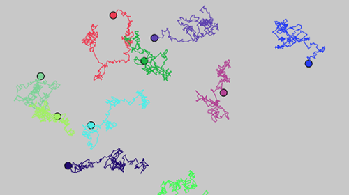
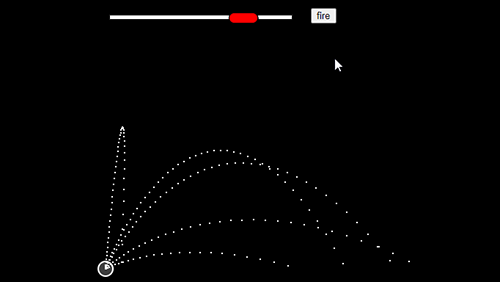

# Simulations with p5.js

## About

This repository showcases a diverse range of captivating simulations, all built using the powerful [p5.js](https://p5js.org/) library.

This collection features interactive simulations covering a wide array of fascinating topics. Each simulation is meticulously crafted to provide an engaging and immersive experience.

The inspiration for many of these simulations comes from the brilliant work of [Daniel Shiffman](http://twitter.com/shiffman) and his incredible YouTube channel, [The Coding Train](https://www.youtube.com/channel/UCvjgXvBlbQiydffZU7m1_aw). Through his tutorials and creative coding projects, Daniel has inspired countless developers and artists to explore the exciting world of coding.

## Examples

Here are a few examples of the simulations you can find in this repository:

|  |  |  |
| :---: | :---: | :---: |
| [Random walkers](https://vislupus.github.io/p5-simulations/random_walkers.html) | [Random walkers with Perlin noise](https://vislupus.github.io/p5-simulations/random_walkers_perlin_noise.html) | [Deposition of thin films](https://vislupus.github.io/p5-simulations/deposition.html) |

|  |  |  |
| :---: | :---: | :---: |
| [Cannonball shooting](https://vislupus.github.io/p5-simulations/ball_cannon.html) | [Applying forces to a ball with mass](https://vislupus.github.io/p5-simulations/ball_apply_force_and_mass_mult.html) | []() |

|  |  |  |  |
| :---: | :---: | :---: | :---: |
| [Sound wave](https://vislupus.github.io/p5-simulations/sound_wave.html) | [Standing wave](https://vislupus.github.io/p5-simulations/standing_wave.html) | [Harmonic oscillator](https://vislupus.github.io/p5-simulations/harmonic_oscillator.html) | [Damped harmonic oscillator](https://vislupus.github.io/p5-simulations/damped_harmonic_oscillator.html) |

|  |  |  |
| :---: | :---: | :---: |
|  |  |  |

|  |  |  |
| :---: | :---: | :---: |
| [Exoplanet Exploration](https://vislupus.github.io/p5-simulations/exoplanet.html) | [Brownian motion](https://vislupus.github.io/p5-simulations/brownian_motion.html) | [Fluid dynamics](https://vislupus.github.io/p5-simulations/fluid_dynamics.html) |

|  |  |  |
| :---: | :---: | :---: |
| [Mutual gravitational attraction](https://vislupus.github.io/p5-simulations/mutual_gravitational_attraction.html) | [Solar system](https://vislupus.github.io/p5-simulations/solar_system.html) | [Collision](https://vislupus.github.io/p5-simulations/collision.html) |

|  |  |  |
| :---: | :---: | :---: |
| [Multiple gravitational attractors](https://vislupus.github.io/p5-simulations/multiple_gravitational_attractors.html) | [Gravitational attraction](https://vislupus.github.io/p5-simulations/gravitational_attraction.html) | [Wheel of fortune](https://vislupus.github.io/p5-simulations/wheel_of_fortune.html) |

Feel free to explore these examples and more in the repository! To run a simulation locally, follow these steps:

1. Clone this repository to your local machine:
```
git clone https://github.com/vislupus/p5-simulations.git
```
2. Navigate to the specific simulation you are interested in.

3. Open the corresponding HTML file in your web browser.

## Contribution

We welcome contributions from the community to enhance this collection of simulations. If you have an idea for a new simulation or an improvement to an existing one, please feel free to submit a pull request. Together, we can make this repository an even richer resource for learning and creativity.

## License

This repository is licensed under the [MIT License](LICENSE). You are free to use the code and adapt it for your own projects.

## Acknowledgements

We would like to express our gratitude to [Daniel Shiffman](http://twitter.com/shiffman) for his invaluable contributions to the coding community and for inspiring the simulations in this repository. Additionally, we would like to thank the p5.js community for their continuous support and the developers behind the p5.js library for providing such a powerful and accessible tool.

<!--
|  |  |  |
| :---: | :---: | :---: |
| []() | []() | []() |
-->
